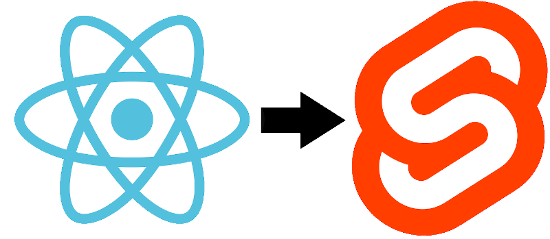

# Sveno
### Description
Sveno is a component transpiler that transform React components to Svelte components. It only works on simple small non-library components so far, but more updates are coming.

Sveno aims to become a powerfull tool able to transpile complete projects, and to help developpers discover the advantages of using Svelte.

### Why use Svelte
While React is a library that adds extra weight to your code base and uses a virtual DOM, Svelte compiles it's files to ideal javascript, thus reducing the actual weight. As a result, Svelte is significantly faster than any framework or library using virtual DOMs.

[Learn more here](https://svelte.dev/blog/virtual-dom-is-pure-overhead)

### Setup

You'll need Python3 and pip3 installed.
Install the requirements with `pip3 install -r ./src/requirements.txt` 
Congratz \\(^o^)/ ! You're ready to go!

### Usage

The program takes 2 arguments: the react source folder and a svelte destination folder

`python3  ./src/main.py react_source_folder svelte_destination_folder`

### How does it work

Using a set of regex, variables, functions, components and imports are gathered and re-assembled into lighter and smooth Svelte syntax.

## Contributors:
- [Allan](https://github.com/Gfaim)
- [Amoz Pay](https://github.com/amozpay)
- [Baptiste Barbotin](https://github.com/barbo69)
- [Tom Chaveau](https://github.com/TomChv)
